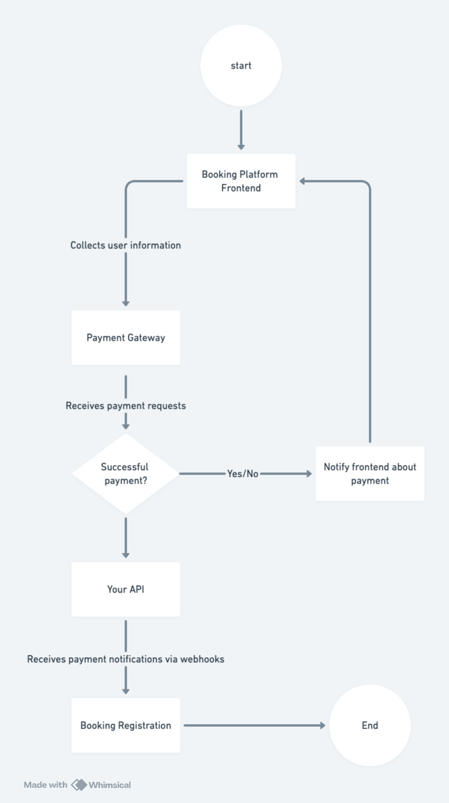

# Roomsure Booking Platform API

Welcome to the Roomsure Booking Platform API documentation. Roomsure is a booking platform that allows users to rent rooms and manage bookings seamlessly. This API provides endpoints for managing rooms, bookings, and payments.



## Requirements

Before proceeding, make sure you have the following installed on your machine:

- Node.js
- npm (or Yarn)


## Installation

1. Install project dependencies.

```bash
npm install
# or
yarn install
```

## Execution

To start the API, run the following command:

```bash
npm run start:dev
# or
yarn start:dev
```

This will start the development server. The API will be accessible at `http://localhost:3000` by default.

or use docker

```bash
docker-compose up -d
```

this will start the application using the configuration specified in the `docker-compose.yml` file. The `-d` flag runs the containers in detached mode.


## Environment Variables

Before running the application, you need to configure the following environment variables:

| Variable       | Description                            |
| -------------- | -------------------------------------- |
| PORT           | Port on which the server will listen.  |
| DATABASE_URL   | URL of the database connection.        |
| DATABASE_TYPE  | Type of database used (e.g., PostgreSQL, MySQL). |

Ensure these environment variables are correctly configured in the `.env` file before starting the application.


## Modules

The Roomsure API is divided into three main modules:

1. **Rooms:** This module handles the management of rooms available for rent. Users can view room details, check availability, and make bookings.

2. **Bookings:** The bookings module facilitates the creation, retrieval, and management of bookings. Users can view their bookings, modify reservation details, and cancel bookings if necessary.

3. **Payment:** The payment module integrates with a payment gateway to process transactions securely. It handles payment authorization, capturing funds, and refunds.

## Database Setup

To set up the Roomsure application database, navigate to the `database` directory. Inside, you'll find SQL scripts necessary to initialize the application database schema. The application uses PostgreSQL as its database system.

## Payment Gateway Service

Roomsure integrates with a payment gateway service to handle payment transactions securely. Inside the `_services/payment-gateway` directory, you'll find a simulated payment gateway service. This service is used for testing and demonstration purposes, allowing you to simulate payment transactions within the application.

## API Endpoints

### Rooms

- **GET /rooms**: Retrieve a list of available rooms.
- **GET /rooms/{roomId}**: Retrieve details of a specific room by ID.

### Bookings

- **GET /bookings**: Retrieve a list of all bookings.

### Payment

- **POST /payment/webhook**: Receive notifications of payment events and authorize a payment for a booking..

## Contact

If you have any questions or need further assistance, please contact the Roomsure support team at matheusmmelchiades@gmail.com.

Thank you for choosing Roomsure! We hope you enjoy using our booking platform.